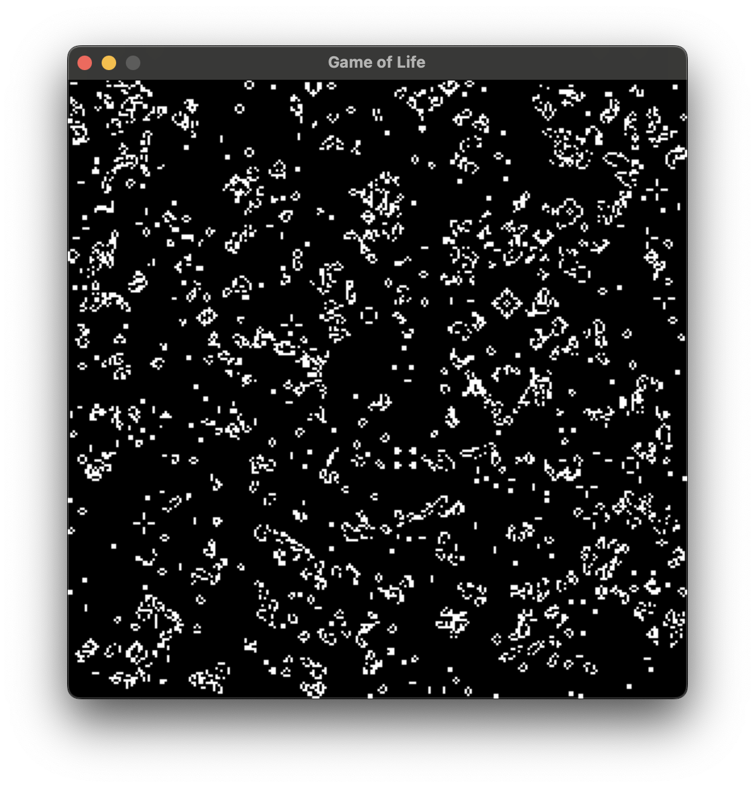

# Rusty Life

Conway's game of life written in Rust.
This project serves for me to learn some basics of Rust, and to submit for Hack Club Siege!

It's currently a work in progress, but it has a GUI using simple, and functions fairly fast.

I plan to implement algorithms for it such as HashLife and QuickLife, but they are too complicated to get an understanding of and complete in four hours.

## Examples

<video width="320" height="240" controls>
  <source src="readme/recording.mov" type="video/mp4">
</video>